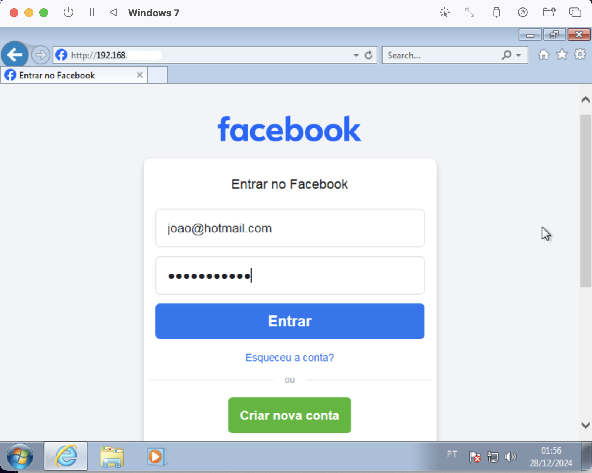
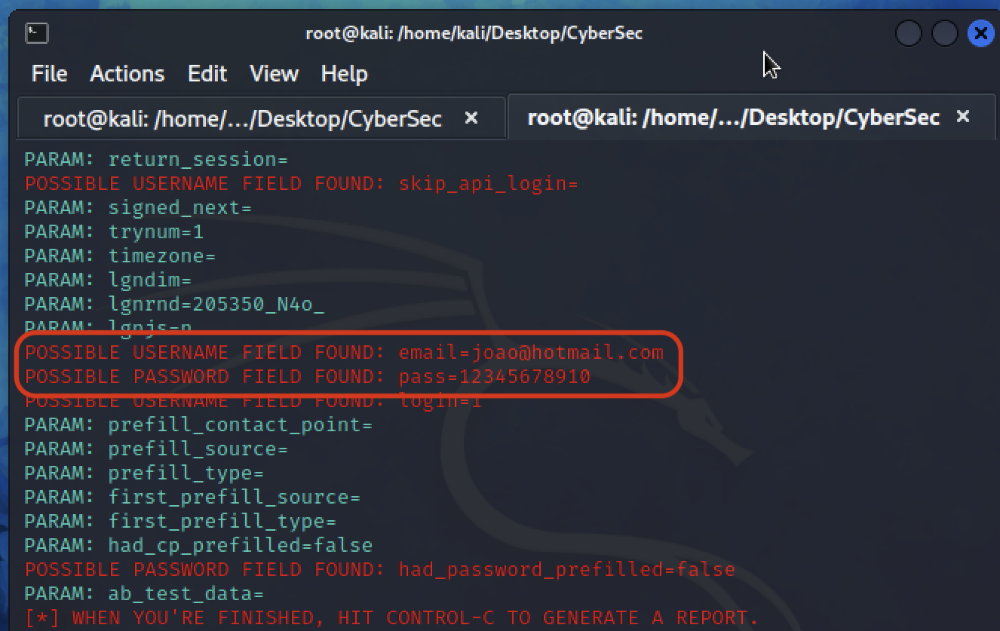

## EN

### Setting up a simple Phishing Attack using <a href="https://github.com/trustedsec/social-engineer-toolkit"> Social-Engineer Toolkit </a>

This documentation is part of a DIO Cyber Security bootcamp project and is available for educational purposes only, not being meant to be used for doing harm to others or for any illegal practice.

This challenge was conducted on a Kali Linux Virtual Machine. Although this is a simple process and could be done using your own operational system, start using virtualization and Kali Linux is interesting for those involved with cyber security studying, because Kali OS provides lots of pentesting and attacking tools (including SE Toolkit), while virtualization allows the creations of a sandbox/laboratory for cyber security studying, testing and exploring. Therefore, it is recommended to choose a virtualization software like VirtualBox or UTM (for Macs, especially ARM based) and create a Kali Linux virtual machine (search for "how to create a kali linux virtual machine using virtual box/utm")

#### 1 - Go to root

Inside Kali Linux, open the terminal and run '''sudo su''' to go to the root user. Insert the password for the root user.

#### 2 - Start SE Toolkit

Invoke SE Toolkit: '''setoolkit'''

#### 3 - Social-Engineering Attacks

From the menu, choose "Social-Engineering Attacks"

#### 4 - Website Attack Vectors

Choose "Website Attack Vectors"

#### 5 - Credential Harvester Attack Method

Choose "Credential Harvester Attack Method"

#### 6 - Site Cloner

Choose "Site Cloner"

#### 7 - Confirm host IP Address

Press Enter/Return to confirm the host IP Address to be used

#### 8 - Enter the URL to clone

The URL provided must be complete, including "http://", for example: "https://www.facebook.com/"

A server with the cloned page will be set up in the address of the host IP (step 7) and can be accessed through the browser. The credentials passed to the phishing page should appear in the SE Toolkit report and the fake server should then redirect the victim to the real Facebook page, masking the scam. Nevertheless, modern browsers should efficiently block the request through CORS (Cross-Origin Resource Sharing) security machanism. Though, it actually worked (the passed credentials arrived to SET report) when I tested using Internet Explorer on a Windows 7 VM to access the server.

## PT - BR

### Configurando um Ataque de Phishing Simples usando o <a href="https://github.com/trustedsec/social-engineer-toolkit">Social-Engineer Toolkit</a>

Esta documentação faz parte de um projeto de um bootcamp de Cibersegurança da DIO e está disponível apenas para fins educacionais, não devendo ser usada para práticas maldosas ou ilegais.

Este desafio foi realizado em uma máquina virtual com o sistema operacional Kali Linux. Apesar de ser um processo simples que poderia ser feito em seu próprio sistema operacional, começar a utilizar virtualização e o Kali Linux é interessante para quem está estudando cibersegurança, pois o Kali OS oferece diversas ferramentas de pentest e ataque (incluindo o SE Toolkit), enquanto a virtualização permite a criação de um sandbox/laboratório para estudos, testes e exploração em cibersegurança. Portanto, recomenda-se escolher um software de virtualização, como VirtualBox ou UTM (para Macs, especialmente os baseados em ARM), e criar uma máquina virtual com o Kali Linux (procure por "como criar uma máquina virtual do Kali Linux usando VirtualBox/UTM").

#### 1 - Acesse o usuário root

No Kali Linux, abra o terminal e execute o comando '''sudo su''' para acessar o usuário root. Insira a senha do usuário root.

#### 2 - Inicie o SE Toolkit

Invoque o SE Toolkit: '''setoolkit'''

#### 3 - Ataques de Engenharia Social

No menu, escolha "Social-Engineering Attacks".

#### 4 - Vetores de Ataque em Sites

Escolha "Website Attack Vectors".

#### 5 - Método de Captura de Credenciais

Escolha "Credential Harvester Attack Method".

#### 6 - Clonador de Sites

Escolha "Site Cloner".

#### 7 - Confirme o endereço IP do host

Pressione Enter/Return para confirmar o endereço IP do host a ser utilizado.

#### 8 - Insira a URL a ser clonada

A URL fornecida deve estar completa, incluindo "http://", por exemplo: "https://www.facebook.com/".

Um servidor com a página clonada será configurado no endereço do IP do host (passo 7) e poderá ser acessado pelo navegador. As credenciais inseridas na página de phishing devem aparecer no relatório do SE Toolkit, e o servidor falso deve então redirecionar a vítima para a página real do Facebook, mascarando o golpe. No entanto, navegadores modernos devem bloquear a solicitação de forma eficiente por meio do mecanismo de segurança CORS (Cross-Origin Resource Sharing). Entretanto, funcionou (as credenciais chegaram ao relatório do SET) quando testei usando o Internet Explorer em uma máquina virtual com Windows 7 para acessar o servidor.

